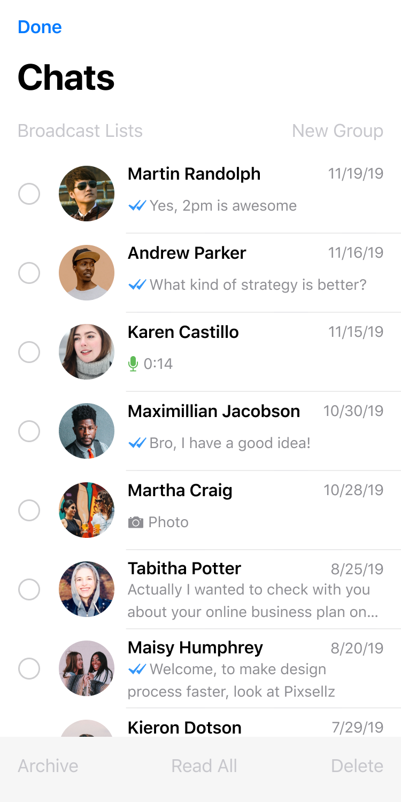
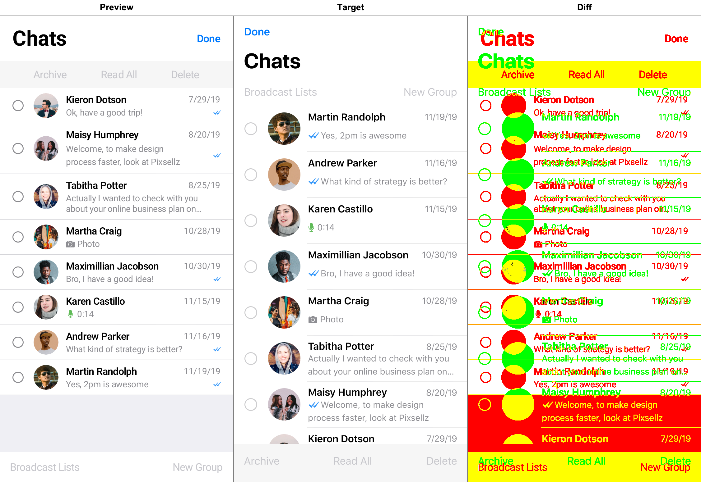
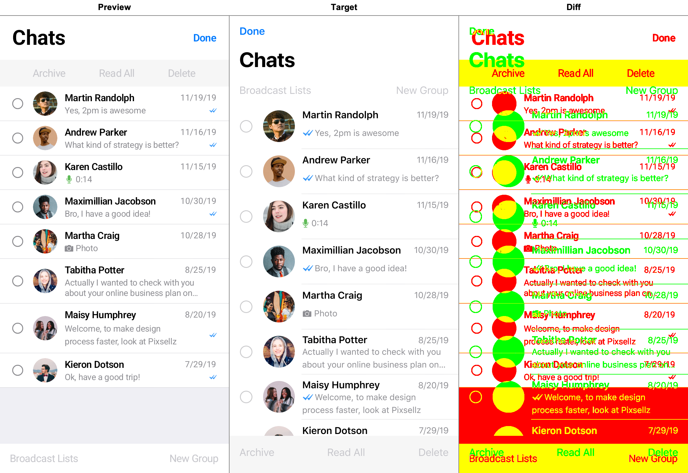
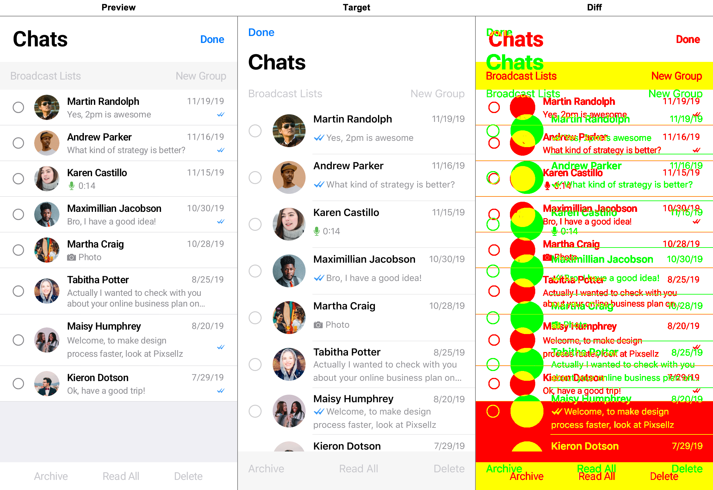

# User: https://www.figma.com/design/eHJpEV5zajOq1m7Y3hmmMa/Composer-Sample--WhatsApp?node-id=0-8114&t=MIH7PlBYXMnuxyTp-4

## Assistant:


### Composer Initial Figma Tree

```
Figma tree analyzed: 119 total nodes with maximum depth of 6
```


### Composer Initial Figma Preview




### Composer Initial Figma Img Assets


### Composer Initial Figma Svg Assets

**read_icon_1.xml**


**read_icon_2.xml**


**select_icon.xml**


**photo_icon.xml**


**read_icon.xml**


**voice_record_icon.xml**


**select_icon.xml**


**read_icon.xml**


**select_icon.xml**


**select_icon.xml**


**read_icon.xml**


**select_icon.xml**


### List Dir - `./`


### List Dir - `app/src/main`


### List Dir - `app/src/main/java/com`


### List Dir - `app/src/main/java/com/firebender/whatsapp`


### Read File - `app/src/main/java/com/firebender/whatsapp/ui/ChatScreen.kt`

Now I can see this is an edit mode view for WhatsApp chats. Let me look at the Figma design to understand what needs to be implemented. Based on the Figma node tree, I need to create a chat list in edit mode with selection circles for each chat. Let me check the drawable resources first:

### List Dir - `app/src/main/res/drawable`

Now let me look at the theme to understand the colors used:

### Read File - `app/src/main/java/com/firebender/whatsapp/ui/theme`


### List Dir - `app/src/main/java/com/firebender/whatsapp/ui/theme`


### Read File - `app/src/main/java/com/firebender/whatsapp/ui/theme/Color.kt`

Now let me create the edit mode chat screen based on the Figma design. The design shows:

1. Navigation bar with "Chats" title and "Done" button
2. Action bar with "Archive", "Read All", "Delete" buttons
3. Chat list items with selection circles on the left
4. Bottom action bar with "Broadcast Lists" and "New Group"

### Edit File - `app/src/main/java/com/firebender/whatsapp/ui/ChatScreen.kt`

Now let me compare this with the Figma design to see how it looks:

### Compare Figma And Preview



Pixel Similarity Score: 0.584


I can see several differences:

1. The order of the chats is wrong - the Figma design shows them in the reverse order
2. The navigation bar shows "Done" on the right side only
3. The chat action bar in the Figma shows a gray background with shadow
4. The bottom section shows the chat actions in a different style
5. Some chats don't have read icons as expected

Let me fix these issues:

### Edit File - `app/src/main/java/com/firebender/whatsapp/ui/ChatScreen.kt`


### Compare Figma And Preview



Pixel Similarity Score: 0.581


I can see the main differences now:
1. The bottom navigation shows "Archive", "Read All", "Delete" instead of "Broadcast Lists" and "New Group"
2. The bottom navigation is ordered differently

Let me fix this:

### Edit File - `app/src/main/java/com/firebender/whatsapp/ui/ChatScreen.kt`

Now I need to also fix the layout to use SpaceEvenly instead of SpaceBetween and remove the horizontal padding:

### Edit File - `app/src/main/java/com/firebender/whatsapp/ui/ChatScreen.kt`


### Compare Figma And Preview


Pixel Similarity Score: 0.581


Looking at the comparison, I can see that the structure matches but there are some visual differences. I notice that the chat action bar should be at the bottom, not at the top. Let me reorganize the layout to match the Figma design more closely. The Figma shows:

1. "Chats" with "Done" at the top
2. "Broadcast Lists" and "New Group" in a lighter bar
3. Chat items with selection circles
4. "Archive", "Read All", "Delete" at the bottom

### Edit File - `app/src/main/java/com/firebender/whatsapp/ui/ChatScreen.kt`


### Compare Figma And Preview



Pixel Similarity Score: 0.581


