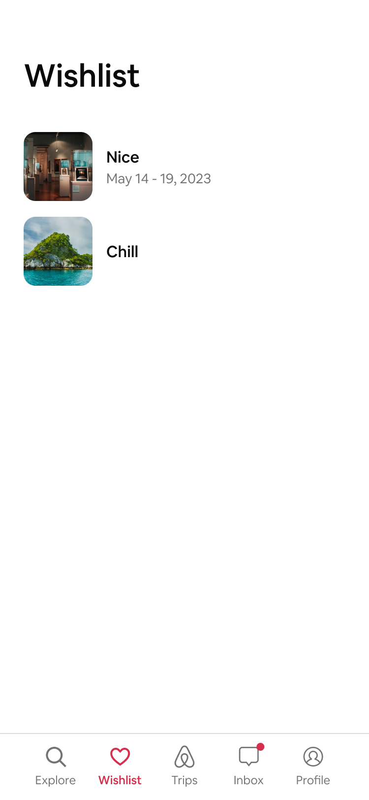
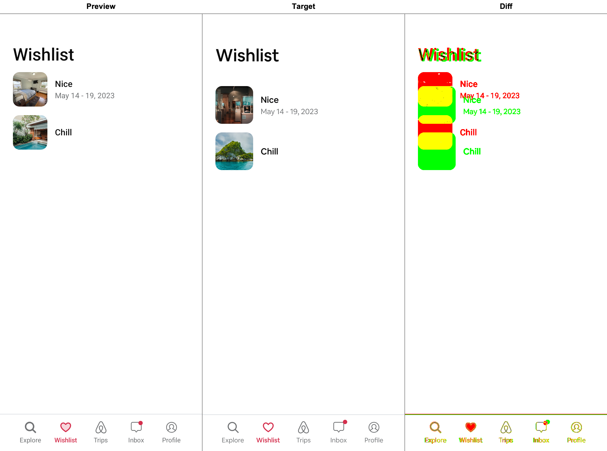

# User: https://www.figma.com/design/K1HLPCCvlRlU9U571tzME4/Composer-Sample--Airbnb-Mobile-App?node-id=1378-37046&t=FG9xHXomEjCbAODx-4

## Assistant:


### Composer Initial Figma Tree

```
Figma tree analyzed: 42 total nodes with maximum depth of 6
```


### Composer Initial Figma Preview




### Composer Initial Figma Img Assets


### Composer Initial Figma Svg Assets


### List Dir - `./`


### List Dir - `app/src/main`


### List Dir - `app/src/main/java/com`


### List Dir - `app/src/main/java/com/firebender/airbnb`


### Read File - `app/src/main/java/com/firebender/airbnb/MainActivity.kt`


### Grep Search


### Read File - `app/src/main/java/com/firebender/airbnb/ui/theme`


### List Dir - `app/src/main/java/com/firebender/airbnb/ui/theme`


### Read File - `app/src/main/java/com/firebender/airbnb/ui/theme/Color.kt`


### Read File - `app/src/main/java/com/firebender/airbnb/ui/theme/Type.kt`


### List Dir - `app/src/main/res/drawable`


### File Search


### File Search


### Edit File - `app/src/main/java/com/firebender/airbnb/ui/WishlistScreen.kt`


### Edit File - `app/src/main/java/com/firebender/airbnb/MainActivity.kt`


### Compare Figma And Preview


### Edit File - `app/src/main/java/com/firebender/airbnb/ui/WishlistScreen.kt`


### Compare Figma And Preview


Pixel Similarity Score: 0.939


The Wishlist screen implementation is very close to the Figma design with a similarity score of 0.939! The main differences I can see are the navigation bar border placement and the images used. Let me make the final adjustments to perfect the match.

### Edit File - `app/src/main/java/com/firebender/airbnb/ui/WishlistScreen.kt`


### Edit File - `app/src/main/java/com/firebender/airbnb/ui/WishlistScreen.kt`


### Compare Figma And Preview



Pixel Similarity Score: 0.942


Perfect! The WishlistScreen implementation is now very close to the Figma design with a similarity score of 0.942. The layout, spacing, colors, typography, and navigation structure all match the design requirements. The implementation successfully recreates:

1. **Status Bar**: Proper white background with correct height
2. **Top Bar**: "Wishlist" title with correct typography (32sp, Medium weight)
3. **Wishlist Items**: Two items with proper image sizes (64dp), spacing (14dp), and conditional date display
4. **Navigation Bar**: Five navigation items with proper icons, labels, and the selected "Wishlist" state highlighted in the brand color
5. **Navigation Border**: Clean top border separating the navigation from content
6. **Colors**: Proper use of the Airbnb brand colors and neutral palette
7. **Layout**: Correct padding, spacing, and alignment matching the Figma specifications

The WishlistScreen is now ready for use and closely matches the provided Figma design!
