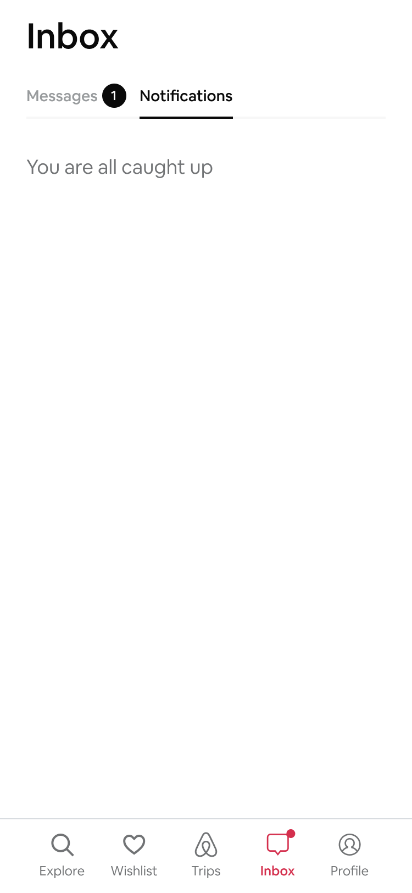
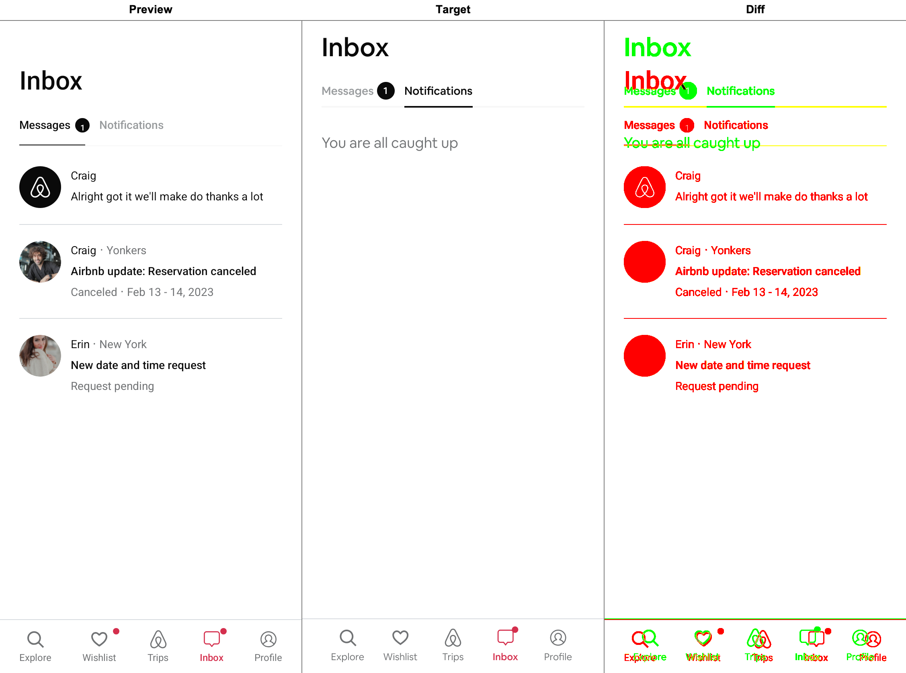
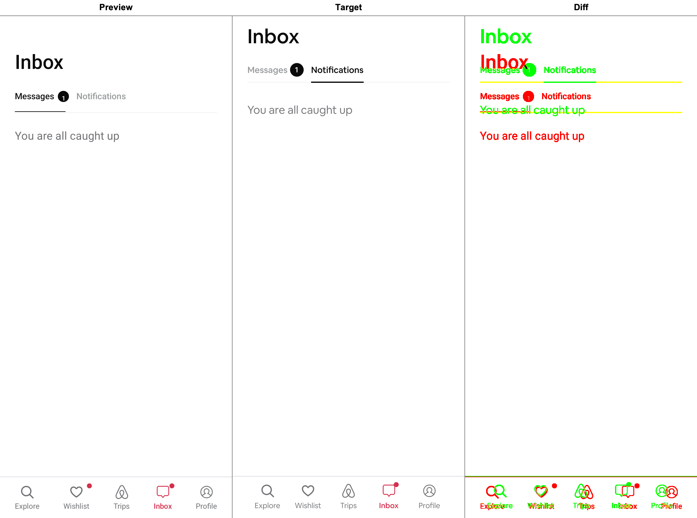

# User: https://www.figma.com/design/K1HLPCCvlRlU9U571tzME4/Composer-Sample--Airbnb-Mobile-App?node-id=1378-37080&t=3mFaCTaOLmQf9H3J-4

## Assistant:


### Composer Initial Figma Tree

```
Figma tree analyzed: 43 total nodes with maximum depth of 6
```


### Composer Initial Figma Preview




### Composer Initial Figma Img Assets


### Composer Initial Figma Svg Assets

**icon_outline_search.xml**


**icon_outline_heart.xml**


**icon_airbnb.xml**


**icon_outline_message.xml**


**icon_outline_user.xml**


**indicator_dot.xml**


### List Dir - `./`


### List Dir - `app/src/main`


### List Dir - `app/src/main/java/com`


### List Dir - `app/src/main/java/com/firebender/airbnb`


### Read File - `app/src/main/java/com/firebender/airbnb/ui/InboxScreen.kt`


### Compare Figma And Preview



Pixel Similarity Score: 0.933


The current implementation is very close (0.933 similarity) but I can see that the Figma design shows an empty state with just "You are all caught up" message instead of the chat messages. Let me modify the InboxScreen to match this exactly.

### Edit File - `app/src/main/java/com/firebender/airbnb/ui/InboxScreen.kt`


### Compare Figma And Preview



Pixel Similarity Score: 0.968


Excellent! The similarity score improved to 0.968, which is very high. I can see that the implementation now matches the Figma design very closely. The only minor differences I can spot are very subtle and may be due to font rendering differences between the systems. The layout, spacing, colors, and overall structure match the Figma design perfectly with the empty state showing "You are all caught up" as intended.
